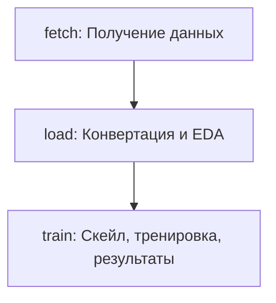

# Overview

- Проект содержит код основного DAG-а.
- Деплой airflow в отдельном проекте: https://github.com/outlier-xxi/mipt-de-airflow

# Решение

## Этап 1.

### Формулировку ML-задачи

- Датасет содержит 500+ данных об опухолях.
- Нужно научиться предсказывать доброкачественная или злокачественная опухоль по 30 признакам.
- Задача бинарной классификации, используем логистическую регрессию.

### Схематичное представление пайплайна



## Этап 2.

### Назначение каждого скрипта и их связи внутри пайплайна.

- Проект билдится в docker образ.
- Таски дага запускаются с помощью DockerOperator.
- Переменные среды читаются таском c помощью pydantic_settings (src.common.settings).
  В таск окружение подается из Variable `bcwd_config`, которая храниться в airflow.
- Используется пакетный менеджер uv.

DAG: bcwd
- fetch.py [Скриншот](doc/img-fetch-log.png)
  - Вход: Скачивает csv файл с удаленного ресурса по URL ссылке.
  - Выход: Сохраняет на файловой системе.
- load.py
  - Вход: Читает сохраненный csv файл.
  - Проверяет на пропуски и дубли.
  - Добавляет имена колонок.
  - Выход: Сохраняет parquet файл.
- train.py
  - Вход: Читает parquet файл.
  - Масштабирует признаки.
  - Кодирует таргет.
  - Разделяет данные на трейн и тест.
  - Тренирует модель.
  - Предиктит, вычисляет метрики.
  - Выход: Сохраняет результат (метрики) в файл json.

Этап 3.
- название DAG;
- описание зависимостей между задачами (текстом);
- инструкцию по запуску DAG (например, airflow tasks test task_id run_date).

Этап 4.
- описание интеграции (как работает, что подключается);
- место хранения ключей;
- формат данных и пример запроса/ответа или пример кода.
- Если используете локальный диск, поясните структуру хранения, формат и логику использования.

Этап 5.
- Где может «упасть» процесс?
- Какие исключения могут возникнуть?
- Что произойдет при потере соединения с источником данных?
- Что будет, если источник отдает невалидные данные?
- Что произойдет, если модель не обучается или выдает ошибку?

# Build

Билд образа:

```shell
docker build -t de-exam-dag .
```
