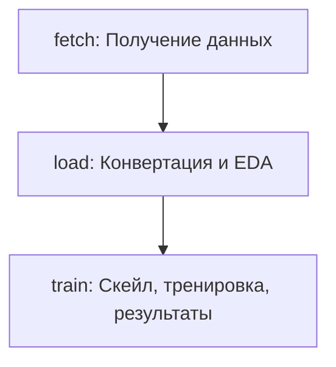

# Overview

- Проект содержит код основного DAG-а.
- Деплой airflow в отдельном проекте: https://github.com/outlier-xxi/mipt-de-airflow

# Решение

## Этап 1.

### Формулировку ML-задачи

- Датасет содержит 500+ данных об опухолях.
- Нужно научиться предсказывать доброкачественная или злокачественная опухоль по 30 признакам.
- Задача бинарной классификации, используем логистическую регрессию.

### Схематичное представление пайплайна



Данные на входе и выходе тасков: 

```text
fetch: website       >> .csv file
load:  .csv file     >> .parquet file
train: .parquet file >> results.json
```

## Этап 2.

### Назначение каждого скрипта и их связи внутри пайплайна.

- Проект билдится в docker образ.
- Таски дага запускаются с помощью DockerOperator.
- Переменные среды читаются таском c помощью pydantic_settings (src.common.settings).
  В таск окружение подается из Variable `bcwd_config`, которая храниться в airflow.
  Т. е. все необходимые значения и ключи можно хранить в airflow variable.
- Используется пакетный менеджер uv.
- Для логирования используется loguru. Логи пишутся в stdout.
- Airflow деплоится отдельным проектом (не содержит inventory).

DAG: bcwd
- fetch.py [Скриншот](doc/img-fetch-log.png)
  - Вход: Скачивает csv файл с удаленного ресурса по URL ссылке.
  - Выход: Сохраняет на файловой системе.
- load.py [Скриншот](doc/img-load-log.png)
  - Вход: Читает сохраненный csv файл.
  - Проверяет на пропуски и дубли.
  - Добавляет имена колонок.
  - Выход: Сохраняет parquet файл.
- train.py [Скриншот](doc/img-train-log.png)
  - Вход: Читает parquet файл.
  - Масштабирует признаки.
  - Кодирует таргет.
  - Разделяет данные на трейн и тест.
  - Тренирует модель.
  - Предиктит, вычисляет метрики.
  - Выход: Сохраняет результат (метрики) в файл json.

## Этап 4.

Используется следующая структура файловой системы:

```text
/hdd            - Докер маунт хостовой системы. 
/hdd/data/      - Сюда сохраняются `wbdc.csv` и `wbdc.parquet` файлы.
/hdd/results/   - Сюда сохраняется `results.json`.
```

## Этап 5.

### - Где может «упасть» процесс?

- Скачивание файла.
- Обработка данных.
- Чтение, запись файлов.
- Обучение.

Обработка отказов:
- В принципе таски можно просто перезапускать для достижения результата. Т. е. 
  они написаны с учетом идемпотентности.
- У таска можно увеличить retry и интервал.
- При необходимости можно добавить обработку специальных исключений. Можно части
  кода выносить в функции и оборачивать в tenacity.
 
# Build

Билд образа:

```shell
docker build -t de-exam-dag .
```
